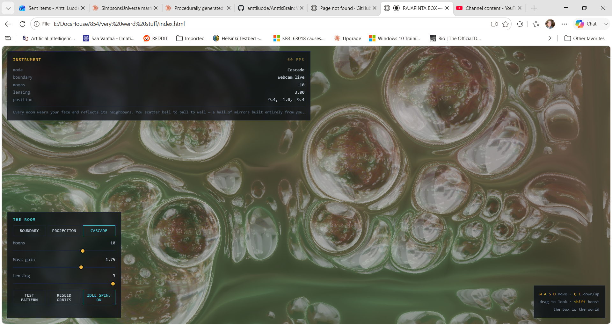

# AnttisBrain

Welcome to Antti's brain. It is a scary place.

Test it live: https://anttiluode.github.io/AnttisBrain/ the version in the image is cascade mode with webcam on. 




Four small worlds you can fly through in a browser. Each is a single self-contained HTML file — no build step, no dependencies, no server. Open one and you are inside it. They share a lineage and a discipline: every visual thing on screen is a real technique doing what the label says, and where something is an approximation, it says so.

**Live:** the repo deploys to GitHub Pages, so each world is playable at
[`https://anttiluode.github.io/AnttisBrain/<file>.html`.](https://anttiluode.github.io/AnttisBrain/)

---

## The lineage in one paragraph

These grew out of a long argument about whether a universe could be a low-dimensional signal "blown up" into a world you can move through. The honest answer turned out to be: not by inverse-FFT of a boundary — that's slow, lossy, and blurry — but yes by the techniques these files actually use. Spectral synthesis really does turn a few numbers into terrain. A distance field really is a compact world you ray-march. A `Σ mᵢ/(r+1)` sum really does read as a cosmos of gravity wells. And a curved light path really does bend an image the way mass bends spacetime. Each file keeps the beautiful part of the idea and drops the part that doesn't survive a frame budget.

---

## The worlds

### 1. `rajapinta_engine.html` — spectral SDF flythrough

The origin point. A ray-marched signed-distance world you fly through, built from three ideas that all ship in real engines:

- **The terrain is a spectrally-synthesized heightfield.** Noise octaves are summed with weights `2^(−β·i)`, where β is the spectral slope. Slide β down toward 0.4 and the ground turns jagged and broadband; slide it up toward 3.2 and it smooths into rolling swells. This is the honest version of "a spectrum becomes a landscape" — spectral synthesis, the way No Man's Sky and every infinite-terrain generator actually works, not an FFT reconstruction of a bulk.
- **The bright structures are light, not geometry.** Each "well" emits `Σ mᵢ/(r+1)`, accumulated along the ray as volumetric bloom. That formula is lifted directly from the old space-screensaver's density field — the same heavy-tailed exponential mass distribution, so a few bright wells dominate and the field reads as a cosmos.
- **The wells bend the rays.** With lensing on, each ray deflects toward the wells by `Σ m·dv/r⁴` per step — an analog-gravity nudge. This is where the signature effect first appeared: the moons *drag the ground*. Toggle lensing off and the space goes flat.

Controls: WASD move, QE down/up, drag to look, shift to boost, release to auto-drift. Sliders for spectral slope, well count, and mass gain; toggles for lensing and drift.

### 2. `aeon_forge.html` — a different universe every boot

The forge. Here the seed doesn't just place the moons — it writes the **laws**. Every boot compiles a new universe from a single 32-bit number, deterministically, in fixed order: spectral slope, carrying capacity, fog, lensing strength, the entire colour palette, whether the sky carries a galactic band, and the sign of the arrow of time. Boot the same seed twice and you get bit-identical physics; boot a new one and the rules change, not just the scenery.

Three things make it a forge rather than a viewer:

- **The ground is alive.** A Gray–Scott reaction–diffusion field — the continuous cousin of the Game of Life — runs on the terrain the whole time. Each universe draws one of six regimes (mitosis, coral, worms, mazes, pulse fronts, solitons) and you watch the crust grow, split, and crawl as epochs pass. Turn the time slider up to watch it churn; if a crust dies out it reseeds and says so.
- **The arrow of time is a skew.** Each universe gets a signed skew rotation and shear of the terrain domain — the ground itself slowly flows one way. The sign is drawn from the seed. It is a deliberate nod to the antisymmetric operator `A = (Cτ − Cτᵀ)/2` that runs through the wider research program: the skew half of a lag-covariance is what carries temporal direction.
- **The universe has a history and a name.** Wells accrete when they touch and new stars ignite up to the universe's carrying capacity, each event logged. Every universe is `AEON-<seed>-<epoch>` — the DNA. Copy it, paste it, hand it to someone, and they boot *your* universe at *your* age, because the laws and orbits are analytic in age. Save/Resume also stores your camera locally.

Honest limit: the DNA restores laws and epoch exactly, but the accretion history re-runs rather than replays — a reloaded universe is a twin, not a photograph.

### 3. `rajapinta_box.html` — you are inside your own boundary

The inversion. Instead of flying over a world, you sit at the centre of a cube whose **six walls are your live webcam**. Moons orbit between you and your image, and their mass bends the rays your eye sends toward the walls — so your own face drags and warps as they pass, exactly the way the ground did in the engine. The webcam image itself is never touched; every distortion you see is the geometry of the light path.

- **Lensing** bends each ray toward the wells. Push the slider up and the moons stop dragging and start swallowing — rays wrap far enough around a heavy moon that you see the wall behind you warped into a ring.
- **Mirror moons** reflect the walls: each moon becomes a curved mirror showing a fisheye copy of the boundary — you, reflected in the mass that is simultaneously lensing you.
- **The walls are lit by the wells** via `Σ m/(r+1)`, so a heavy moon passing near a wall brightens your image under it like a lamp.

No camera, or permission denied, falls back to a moving test pattern (the striped orbiting disk with an occluder, from the old SlapStack demo). The physics is identical. Nothing leaves your machine — no server, no upload, single user by design.

### 4. `rajapinta_box_gr.html` — real geodesic lensing

The same box, with the fake force removed. This build integrates **actual null geodesics**. Each moon contributes to an optical Schwarzschild metric, a refractive index `n(x) = 1 + Σ rₛ/|x − xₖ|`, and every ray obeys the real light-ray equation `d/ds(n·u) = ∇n`, stepped in arc length with the tangent projected to stay unit-length.

The point of doing it properly is that the bending is now *correct*, not just plausible. Integrated against Einstein's exact deflection law `α = 4GM/c²b = 2rₛ/b`, the shipped integrator matches to within half a percent in the weak field, with the correct higher-order excess appearing as rays graze closer to a core. So:

- **True Einstein rings.** When a moon lines up between you and a patch of your face on the far wall, that light reaches your eye along a whole ring of curved paths, at the physically correct radius. Not a faked fisheye — a real ring of lensed geodesics.
- **A photon sphere.** Fly close to a heavy moon and rays near it spiral; some escape distorted, some cross the capture radius and fall in, returning black. That gives a heavy moon a genuine shadow rim — the same mechanism behind a black hole's silhouette. A live meter reads out how much of your view is currently falling into cores.

The `Σrₛ` slider is a real mass dial; the geodesic-resolution slider trades sharpness for framerate (geodesic marching is heavier than the fake force, so this build runs at lower internal resolution).

Honest limits: this is the *optical-metric* formulation — exact for light bending and rings to the order that matters, but it models the deflection of light only, not time dilation or redshift. A clock isn't ticking slow in there. And the "ring geometry" inside a small box is dominated by strong-field capture, which is physically correct but not the clean thin-lens ring you'd get with a distant source.

### **5. index.html — the holographic cascade**

The capstone of the boundary-bulk experiments. You sit at the centre of a cube, but here, the holographic principle is a toggle switch. The engine lets you explicitly swap which part of the universe holds information and which part reflects it, giving you three distinct realities built from the exact same geometry.

- **Boundary mode:** The walls are your live webcam; the moons are curved mirrors that lens and reflect the boundary. You watch your face drag across the geometry of the bulk.
- **Projection mode (The swap):** The moons carry the image; the walls become pure mirrors. The information emanates from the bulk and the boundary merely echoes it.
- **Cascade mode:** The fractal collapse. The moons carry your face *and* mirror each other simultaneously. Every ray of light scatters ball to ball to wall in a recursive loop. You are looking at a hall of mirrors built entirely out of your own scattered image, folded through gravity.

The shader logic for Cascade mode breaks the usual rule of rendering where an object is either a light source or a mirror. Here, the moons are both, endlessly accumulating fractions of the observer into the void.

*Like the other boxes, this asks for camera permission. Deny it and it falls back to a moving test pattern with identical physics. Nothing leaves your machine.*

---

## The mathematics, gathered

The four files are four readings of the same handful of objects:

- **Spectral synthesis.** A power-law spectrum `2^(−β·i)` over noise octaves builds terrain. β is the one knob between broadband roughness and smooth swell — the "few numbers → whole world" instinct, done the way that actually works.
- **Signed distance fields.** The world is defined by a function giving distance to the nearest surface; a camera ray marches along it, touching only what it can see. This is why a whole volume can be a few lines of shader.
- **The emission sum `Σ mᵢ/(r+1)`.** A halo field with a heavy-tailed (exponential) mass distribution. Thresholded it is a metaball / density field; summed as light it is a cosmos. The heavy tail is why a few wells dominate and the thing looks structured rather than uniform.
- **Reaction–diffusion (Gray–Scott).** Two coupled fields, `∂u = Dᵤ∇²u − uv² + F(1−u)` and `∂v = Dᵥ∇²v + uv² − (F+k)v`. The `(F, k)` pair selects the regime; the same equations give spots, stripes, mazes, and travelling fronts. This is the living crust in the forge.
- **The antisymmetric / skew operator.** `A = (Cτ − Cτᵀ)/2` — the skew half of a lag-covariance carries temporal direction. In the forge it becomes the signed rotation-shear that gives each universe an arrow of time you can see in the drift of the ground.
- **Gravitational lensing, two ways.** The fake version bends rays by `Σ m·dv/r⁴` — cheap, tunable, "looks like gravity." The real version integrates null geodesics through an optical metric `n = 1 + Σ rₛ/r`, recovering the exact `4GM/c²b` deflection, Einstein rings at the right radius, and photon-sphere capture. The GR file exists to show the difference between "looks bent" and "bends by the correct amount."

The wider connection the theory kept circling — the **holographic** one — is most literal in the box: the walls are a boundary, the moons are a bulk, and the light that reaches your eye is the boundary seen through the bulk's curvature. Swapping which one carries the image and which one reflects it gives genuinely different worlds from the same geometry. That swap is exactly what **index.html** executes, turning a spatial limitation into a fractal cascade.

---

## Running them

Every file is standalone. Clone the repo and open any `.html` in a recent WebGL2 browser (Chrome, Firefox, Edge, Safari), or use the GitHub Pages links above. The two box files ask for camera permission; deny it and they fall back to a test pattern with identical physics. Nothing is uploaded anywhere.

```
git clone https://github.com/anttiluode/AnttisBrain.git
cd AnttisBrain
# open any .html file in a browser
```

Requirements: a WebGL2-capable browser and, for the box files, a webcam (optional). No install, no dependencies.

---

## A note on what these are, and aren't

These are instruments and toys, not physics papers. They make real techniques legible and playable — you can feel what a spectral slope does, watch reaction–diffusion breathe, see mass bend light by the correct law. Where a shortcut is taken, the file and this README name it. That is the whole ethos: do not hype, do not lie, just show.

## License

MIT. See [LICENSE](LICENSE).
